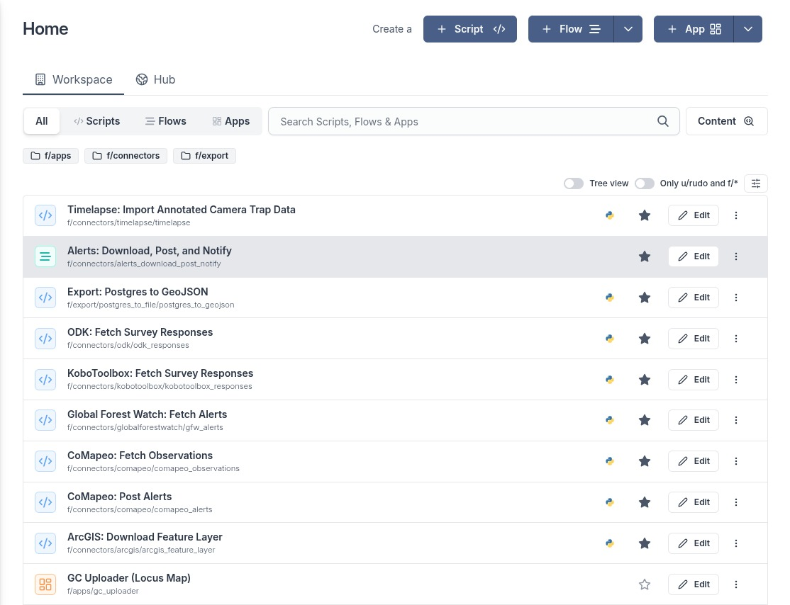
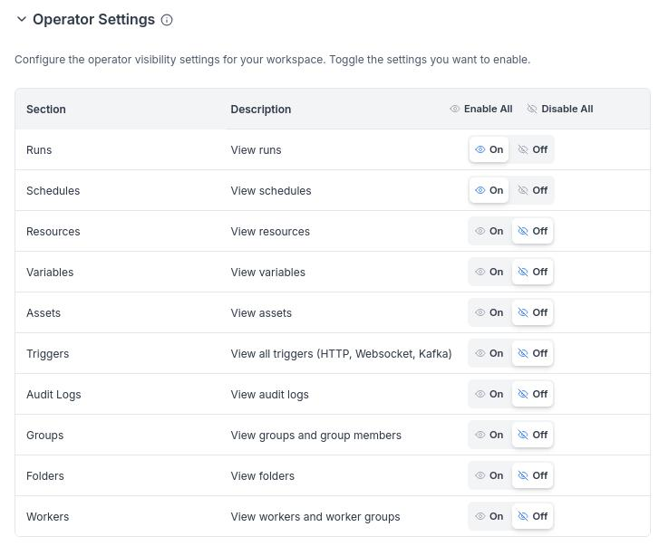
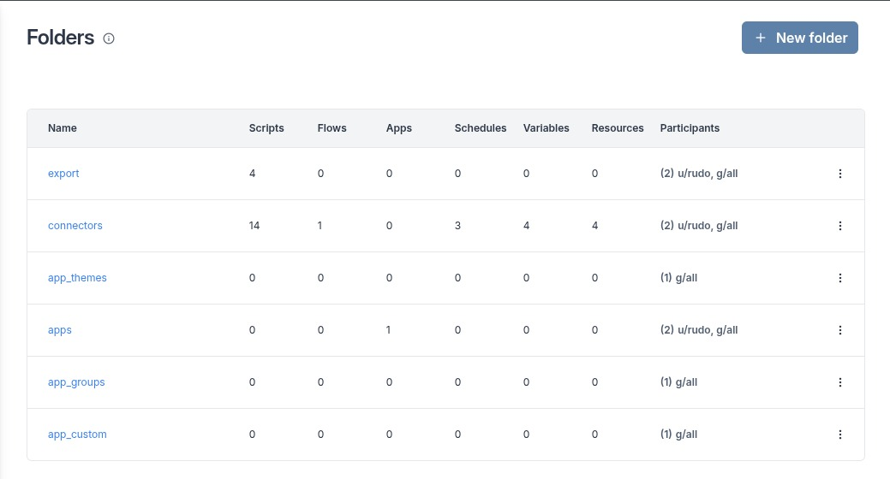

# Guardian Connector Scripts Hub

This repository contains scripts, flows and apps to help communities guard and manage their land.

The code is intended to run on [Windmill](https://www.windmill.dev/), a platform that
can turn scripts into workflows and UIs.  It empowers semi-technical users to access, edit and schedule code 
to run on a given interval without being overwhelmed by the usual barriers to entry (git, IDE, local environments,
secrets managements, etc).

🌱 [Read a blog post about Windmill is being used in this repository for supporting Indigenous communities](https://www.windmill.dev/blog/conservation-metrics-case-study)


## Available scripts, flows, and apps

Some of the tools available in the Guardian Connector Scripts Hub are:

* Connector scripts to ingest data from data collection or annotation tools such as KoboToolbox, ODK, CoMapeo, ArcGIS, Global Forest Watch, Timelapse, and Locus Map, 
  and store this data (tabular and media attachments) in a data lake. 
* A flow to download and store GeoJSON and GeoTIFF change detection alerts, post these to a CoMapeo Archive Server 
  API, and send a message to WhatsApp recipients via Twilio.
* Scripts to export data from a database into a specific format (e.g., GeoJSON).
* An app to import and transform datasets from a variety of file formats and sources into a PostgreSQL database.


_A Windmill Workspace populated with some of the tools in this repository._

## User Roles

In Windmill, there are a number of roles that can be assigned to users, each with different permissions and responsibilities.

Windmill has an [official documentation page](https://www.windmill.dev/docs/core_concepts/roles_and_permissions) that covers the core concepts of roles and permissions in Windmill. 

For a Windmill workspace, you will want at least one [admin](https://www.windmill.dev/docs/core_concepts/roles_and_permissions#admin) user to manage the workspace and configurations. However, you can also set up [operator](https://www.windmill.dev/docs/core_concepts/roles_and_permissions#operator) users with a more limited set of permissions to execute scripts and monitor their progress.

By default, Windmill operators are able to run scripts, set schedules, and create resources and variables. We recommend turning off the ability to create resources and variables for operators, and only allowing them to execute scripts and monitor their progress.

To do this, when logged in as an admin you can navigate to the **Workspace Settings** page, and under the **Users** tab, you can modify the **Operator Settings**. Disable all settings except Runs and Schedules:



Lastly, for operator users to have access to all of the Folders containing the workspace scripts, flows, and apps (e.g. the subdirectories in the `f/` directory), you will need to add a group to which the operator user belongs to all of the folders containing these like `export` and `connectors`. For example, you could add the default `g/all` group to all of the folders containing these, as all users are members of this group by default. You can do this in the **Folders & Groups** page in the Windmill web app:



## Deploying the code to Windmill workspaces

[Install the Windmill CLI](https://www.windmill.dev/docs/advanced/cli), and
[set it up to talk to your deployed Workspace](https://www.windmill.dev/docs/advanced/cli/workspace-management).

Then push the code in this Git repo to your workspace:

    wmill sync push --skip-variables

Folders named `./tests/` are excluded by `wmill.yml` from syncing to Windmill —
because otherwise Windmill tries to make the tests (as with ALL python files) into bona-fide Windmill scripts.

This repo also provides a shell script to batch push changes to a number of workspaces at once. To use this, set the `WORKSPACES` environment variable with a list of workspace names. You can do this directly in the command line:

       WORKSPACES=gc-windmill,gc-testing-server bin/push.sh

   Alternatively, use a subshell to load a WORKSPACES variable from a `.env` file without affecting your current shell environment:

       (set -a; source .env; set +a; bin/push.sh)

### Adding custom resource types

At times, this repository may contain one or more [custom resource types](https://www.windmill.dev/docs/core_concepts/resources_and_types#create-a-resource-type) that are used by a number of the scripts in this repository. However, we commit to adding all of our resource types to [Windmill Hub](https://www.windmill.dev/docs/core_concepts/resources_and_types#sync-resource-types-with-windmillhub).

There is no way to sync custom resource types to a Windmill workspace, so you will need to manually add them. The easiest way to do this is to paste them in to the JSON editor when creating a new resource type.

## Development

In Windmill, scripts can be written in Python, TypeScript, Go, and a number of other languages. Flows and apps can 
be built through the Windmill UI.

The `f/` directory is designated for storing code in a workspace folder, and will be used when synchronizing the contents 
of this repository with a server.

Within the `f/` directory, we store code in directories that represent a specific set of tasks. For example, the 
`f/connectors/` directory contains scripts for data ETL and pipelining tasks.

Note that Windmill also designates a `u/` directory for storing code per user on a workspace. We are not using this 
convention in this repository. See [Windmill's local development guide](https://www.windmill.dev/docs/advanced/local_development) 
for more information on these directories and how they are synchronized with a server.

For information on developing scripts, see the [Windmill Scripts quickstart](https://www.windmill.dev/docs/getting_started/scripts_quickstart).

You may develop within Windmill's code editor, or locally.  Developing locally has the advantage
of being able to run tests.

For users of Visual Studio Code, there is an extension that allows you to code locally, while testing your code in your Windmill workspace. See Windmill's [local development documentation](https://www.windmill.dev/docs/advanced/local_development) for more information.

If you developed on the server, sync your remote changes into Git version control once done:

    wmill sync pull --skip-variables  # optionally add --raw to clobber your local repo
    # TODO: git add, commit, etc

## Tests

### Running tests with the `tox` test runner

Make sure you have Python installed locally or create a virtual environment for your test runner.

Install the following dependencies:
  ```bash
  pip install 'tox>=4.15.0,<5' 'tox-docker~=5.0'
  ```

Then you can run all tests using tox:
  ```bash
  tox
  ```

If you are using homebrew you might have better luck using `pipx` or `uvx` to manage the virtual environment for the
test runner:
  ```bash
  # Install test runner and run test in one go
  uvx --with tox-docker tox
  ```

The `tox-docker` test runner dependency is only required
to run the `alerts` test suite; others can run with only `tox`.

### Individual Test Suites

Each script in `gc-scripts-hub` defines its own virtual env according to the `«scriptname».script.lock` file that Windmill creates.  This means that to test, you'll need to have Windmill create it, either by running the script being tested _at least once in Windmill itself_, or using the CLI:

    wmill script generate-metadata

For more about how Windmill chooses the package dependencies to go in these
metadata/lock files, read https://www.windmill.dev/docs/advanced/imports#imports-in-python

It also means that `tox` creates different environments for each "folder" of scripts.
To run tests for only one folder, specify the folder as an `-e «environment»` CLI arg:

    tox -e alerts

Note that the versions of package dependencies must be the same for scripts across a tox environment,
or you will get an error about conflicting dependencies.

# Running Windmill

[You may get a free cloud workspace, or self-host.](https://www.windmill.dev/docs/getting_started/how_to_use_windmill)

We recommend self-hosting using [CapRover](https://caprover.com/) and its
[Windmill one-click-app](https://github.com/caprover/one-click-apps/blob/master/public/v4/apps/windmill.yml).
