# GC Dataset Importer

A comprehensive Windmill-powered data ingestion application that transforms various geospatial and tabular file formats into standardized PostgreSQL tables for the Guardian Connector data warehouse. It supports multiple file formats, applies data transformations, and ensures data consistency across different data sources.

## How it works

The importer follows a structured 4-step process:

### Step 1: Database Table Validation
- User enters a dataset name for the PostgreSQL table
- System checks if table already exists in the warehouse
- Prompts for alternative name if conflict detected
- Ensures unique table names across the data warehouse

### Step 2: File Upload and Format Detection
- Accepts file uploads with automatic format detection
- Extracts ZIP/KMZ archives and processes contents
- Converts files to standardized formats:
  - **Tabular data** → CSV (Excel, JSON, CSV)
  - **Spatial data** → GeoJSON (GPX, KML, existing GeoJSON)
- Saves parsed files to temporary storage for processing

### Step 3: Data Source Configuration
- User optionally selects source type for known data formats (i.e. CoMapeo, KoboToolbox, ODK, or something else)

### Step 4: Transformation and Database + File Storage
- Optiontally applies data source-specific transformations for known data formats
- Ingests transformed data into PostgreSQL tables
- Archives all file versions (original, parsed, transformed) to data lake
- Cleans up temporary files and reports completion status

## Architecture

### Legend

- 🟦 **Teal boxes** represent **user interface components** (user input, prompts, confirmations).  
  _e.g., table name entry, source confirmation dialogs_

- 🟧 **Peach boxes** are **shared utility scripts** from `common_logic` modules.  
  _e.g., file upload, extraction, format detection, source analysis, disk writing_

- 🟩 **Aqua boxes** denote **tool-specific scripts** from `connectors` used for data transformation and ingestion.  
  _e.g., Locus Map, CoMapeo, CSV to Postgres, GeoJSON handling_

```mermaid
---
config:
  look: handDrawn
  layout: dagre
---
flowchart TD

 %% Unified conversion step
 subgraph Convert["Convert to CSV / GeoJSON"]
        CSV["CSV"]
        GeoJSON["GeoJSON"]
 end

 %% Upload + validation
    GCF[["🧩 Guardian Connector Dataset Importer"]] --> EnterDataset["📝 Enter dataset name"]
    EnterDataset --> CheckDataset["🔍 Check if dataset exists in warehouse DB"]
    CheckDataset --> Exists["⚠️ Already in usage"] & NotExists["✅ Available"]
    Exists --> RetryName["🔁 Prompt for new name"]
    RetryName --> EnterDataset

 %% File detection and parsing
    NotExists --> Upload["📤 Upload File"]
    Upload --> SaveFileToTemp["💾 Save File to Temp"]
    SaveFileToTemp -.-> Extract["📦 Extract Archive File"]
    SaveFileToTemp --> DetectFormat["🔍 Auto-Detect File Format"]
    Extract -.-> DetectFormat
    DetectFormat --> GeoJSON2["GeoJSON"] & CSV2["CSV"] & XLS & JSON & KML & GPX & Shapefile & Other

 %% Format conversion
    XLS --> CSV
    JSON --> CSV
    CSV2 -. already valid .-> CSV
    KML --> GeoJSON
    GPX --> GeoJSON
    Shapefile --> GeoJSON
    GeoJSON2 -. already valid .-> GeoJSON

 %% Optional transformation
    CSV --> PathChoice
    GeoJSON --> PathChoice
    PathChoice{"⚙️ Is this data from a known source or tool?"} -->|Yes| ConfirmSource["🧭 Select known data source (e.g. CoMapeo, Kobo, etc.)"]
    PathChoice -->|No| DirectIngest["📥 Ingest directly to Postgres"]

 %% Optional transformation logic
    ConfirmSource --> BusinessLogic["🧠 Apply Transformation Logic"]
    BusinessLogic --> GeoToPG["🗺️ GeoJSON to Postgres"] & CSVToPG["🗂️ CSV to Postgres"]
    DirectIngest --> GeoToPG & CSVToPG

 %% Final steps
    CSVToPG --> Save["💾 Save Files to Disk"]
    GeoToPG --> Save
    Save --> Success(["🏁 Files successfully saved to the data warehouse!"])
    Other --> NS(["🚫 Unsupported file type"])

 %% Shape styling
    XLS@{ shape: stored-data}
    JSON@{ shape: stored-data}
    KML@{ shape: stored-data}
    GeoJSON2@{ shape: stored-data}
    CSV2@{ shape: stored-data}
    GPX@{ shape: stored-data}
    Shapefile@{ shape: stored-data}
    Other@{ shape: stored-data}
    BusinessLogic@{ shape: procs}

 %% Color classes
    GCF:::Sky
    EnterDataset:::Sky
    CheckDataset:::Peach
    RetryName:::Sky
    Upload:::Sky
    SaveFileToTemp:::Peach
    Extract:::Peach
    DetectFormat:::Peach
    Convert:::Peach
    ConfirmSource:::Sky
    PathChoice:::Sky
    DirectIngest:::Sky
    BusinessLogic:::Aqua
    CSVToPG:::Aqua
    GeoToPG:::Aqua
    Save:::Peach
    Success:::Sky
    NS:::Sky

 %% Theme definitions
    classDef Aqua stroke:#46EDC8,fill:#DEFFF8,color:#378E7A
    classDef Peach stroke:#FBB35A,fill:#FFEFDB,color:#8F632D
    classDef Sky stroke:#374D7C,fill:#E2EBFF,color:#374D7C
    classDef Ash stroke:#999999,fill:#EEEEEE,color:#000000
```

## Technical Implementation

The application uses a Windmill [Stepper](https://www.windmill.dev/docs/apps/app_configuration_settings/stepper) component to guide the user through the 4-step process. For each step, different input components call runnable scripts. In this directory, each script is prefixed with the number representing the step. The Python scripts handle the core logic of the application, whereas the JavaScript scripts set the application's state (either by being called following successful completion of one of the Python scripts, or by being called directly from the user interface).

### Core Python Scripts

#### 1. Database Validation (`1_check_if_database_table_exists.inline_script.py`)
- Implements SQL-safe name validation and sanitization
- Connects to PostgreSQL warehouse to verify table availability
- Returns both user-friendly and SQL-safe dataset names

#### 2. File Processing (`2_upload_and_convert_file.inline_script.py`)
- Leverages `f.common_logic.data_conversion` for format detection and conversion
- Converts all inputs to standardized CSV (tabular) or GeoJSON (spatial) formats
- Saves parsed files to temporary storage for processing

#### 3. Data Transformation (`4_apply_transformation_and_write_to_database.inline_script.py`)
- Applies connector-specific business logic through modular transformation functions
- Supports multiple data source types with extensible transformation pipeline
- Saves transformed data to PostgreSQL tables, and copies all file versions (original, parsed, transformed) to data lake
- Cleans up temporary files and reports completion status

### How to review the code

The `app.yaml` file generated by Windmill is highly impractical to review directly. Instead, it is recommended to sync the app to a Windmill instance, and review the code in the Windmill App builder UI.

## Usage Examples

### Basic CSV Import
1. Enter table name: `community_surveys`
2. Upload: `survey_data.csv`
3. Select source: _none selected_
4. Result: Direct CSV ingestion

### CoMapeo Observations
1. Enter table name: `forest_monitoring`
2. Upload: `observations.geojson` 
3. Select source: `CoMapeo`
4. Result: Enhanced GeoJSON with standardized observation schema

### Locus Map Waypoints
1. Enter table name: `my_waypoints`
2. Upload: `waypoints.gpx`
3. Select source: `Locus Map`
4. Result: Enhanced GeoJSON with standardized waypoint schema

### KoboToolbox Form Responses
1. Enter table name: `survey_responses`
2. Upload: `responses.xls`
3. Select source: _none selected_ (by accident!)
4. Result: Direct CSV ingestion

## TODO

- [ ] Support shapefiles https://github.com/ConservationMetrics/gc-scripts-hub/blob/8574d48e789d88dbec4bb4a80b6f6791f71457c3/f/common_logic/data_conversion.py#L26-L27
- [ ] Allow selection of output format (e.g. convert a GPX to CSV, convert a CSV to GeoJSON, etc.) - https://github.com/ConservationMetrics/gc-scripts-hub/blob/8574d48e789d88dbec4bb4a80b6f6791f71457c3/f/common_logic/data_conversion.py#L139-L148
- [ ] Be more selective in copying files to the data lake (e.g. if only a minor transformation was applied, don't copy the original file)
- [ ] Consider that with the DB no longer externally exposed, how can we remove tables that were accidentally created?
- [ ] Add better Mapeo and Locus Map transformations; CoMapeo TBD depending on fixtures
- [ ] Add mobile view for smaller screens (an option in the Windmill App builder UI)
- [ ] Add option to provide your own data source if not found in the list (so it can be added to a `data_source` column)
- [ ] In the Windmill App UI, provide a preview of the data being uploaded
- [ ] Find a way on the VM to periodically clear temp files for interrupted runs
- [ ] Currently, dataset names are sanitized as `valid_sql_name` for writing to the DB and to a file, and in so doing, transformed into lower case. In the first step, we first check if the table with this name already exists, and if so, prompt the user for a new name. But we don't check if there is already a table with a different case. E.g. if the user enters `My_dataset`, the app will check for `my_dataset`. But it does not check for `My_dataset`.
- [ ] Consider how to apply a transformation post-import
- [ ] Use this tool to append to an existing table
- [ ] Consider adding UUIDs https://github.com/ConservationMetrics/gc-scripts-hub/tree/generate-uuid-for-data-conversion