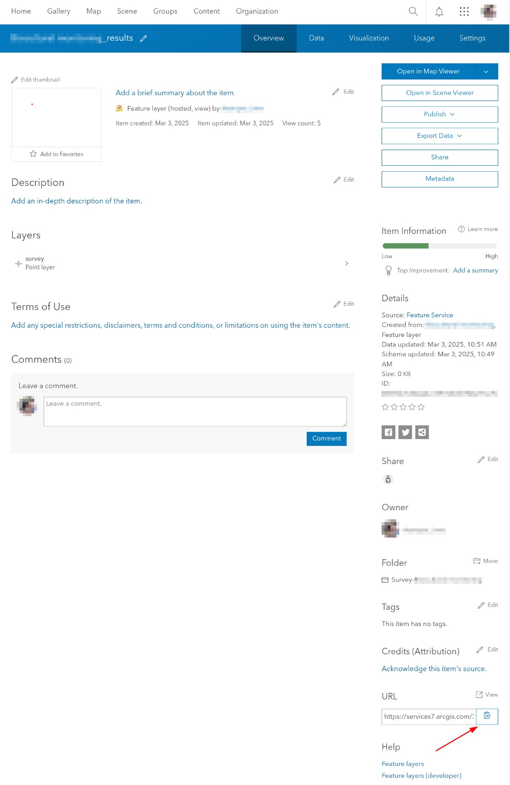

# `arcgis_feature_layer`: Download Feature Layer from ArcGIS REST API

This script fetches the contents of an ArcGIS feature layer and stores it in a PostgreSQL database. Additionally, it downloads any attachments (e.g. from Survey123) and saves them to a specified directory.

Usage of this script requires you to have an ArcGIS account, in order to generate a token.

The feature layer URL can be found on the item details page of your layer on ArcGIS Online:

This script uses the [ArcGIS REST API Query Feature Service / Layer](https://developers.arcgis.com/rest/services-reference/enterprise/query-feature-service-layer/) endpoint.

Note: we have opted not to use the [ArcGIS API for Python](https://developers.arcgis.com/python/latest/) library because it requires installing `libkrb5-dev` as a system-level dependency. Workers in Windmill can [preinstall binaries](https://www.windmill.dev/docs/advanced/preinstall_binaries), but it requires modifying the Windmill `docker-compose.yml`, which is too heavy-handed an approach for this simple fetch script.

# `arcgis_download_feature_layer_anonymously`: Download Feature Layers from ArcGIS API Anonymously

This script fetches the contents of a list of ArcGIS feature layers from an ArcGIS Server, and stores and stores them to the specified directory.

Usage of this script DOESN'T require you to have an ArcGIS account.

In order to use it, you will need:
- domain: where the ArcGIS server is hosted.
- feature_id: The name of the services that is offering the information that wants to be fetched. In ArcGIS, this is called `Service name`.
- service_id: In the ArcGIS documentation this is referred as `context`.
- layer_index_list: a list of indexes of layers belonging to the Service name we are fetching from, that we want to download. We will create one file per layer, and each file will be named with the Layer name given in ArcGIS.
- folder_name: where the data will be stored.
- output_format: could be `geojson` or `csv`
- download_attachments: whether to download attachments if there are any or not.

The entry point for all of this information is an ArcGIS REST Services Directory URL.
Like [this example ArcGIS REST Services Directory URL](https://sampleserver6.arcgisonline.com/arcgis/rest/services).

